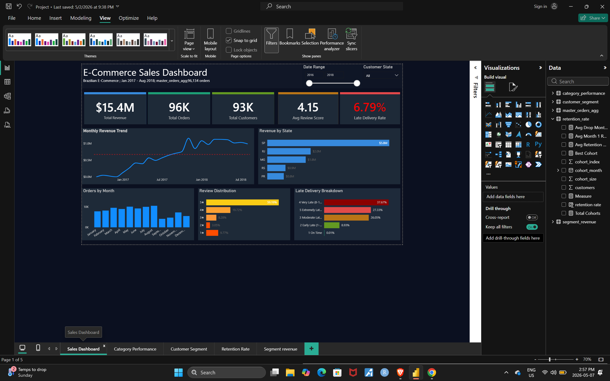
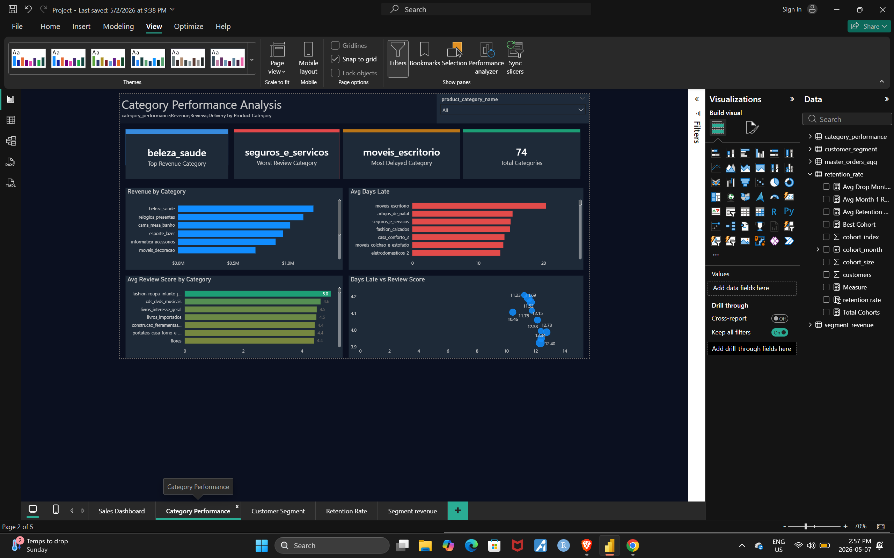
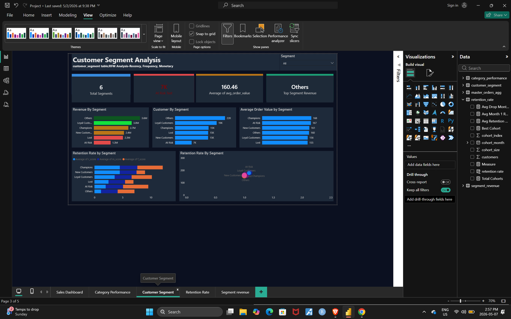
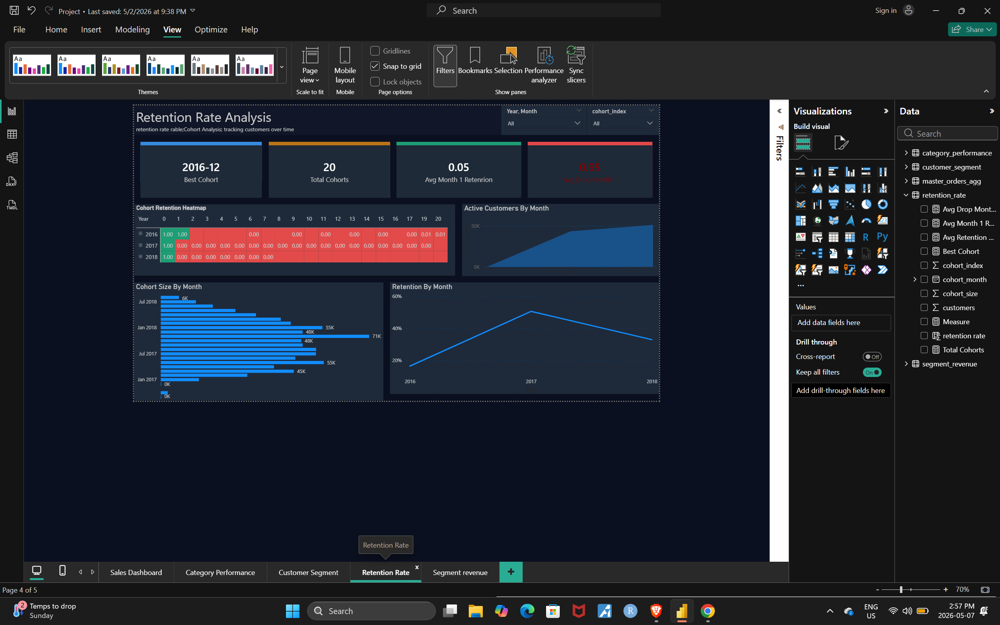
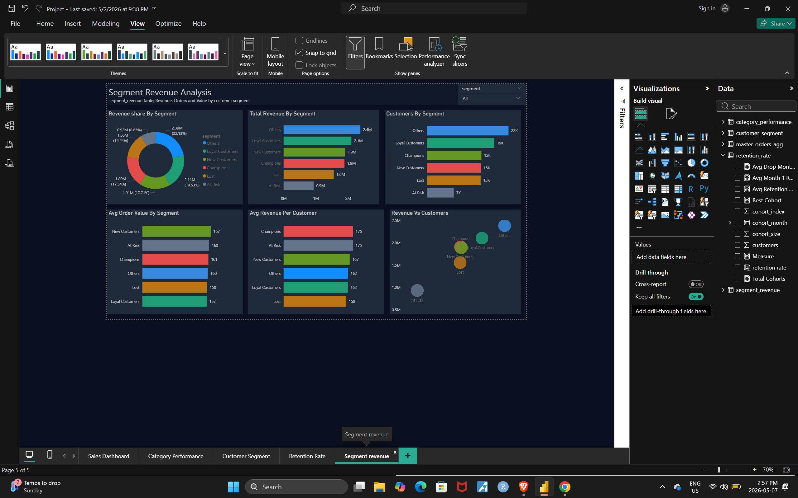

# ecommerce-analysis-dashboard
Brazilian E-Commerce Analytics Dashboard built with Power BI, and BigQuery

# E-Commerce Analytics Dashboard
### Brazilian E-Commerce (Olist) · Power BI · BigQuery · SQL

---

## Project Overview
End-to-end analytics dashboard analyzing **96,134 orders** from the 
Brazilian Olist e-commerce platform (Jan 2017 – Aug 2018).

Built as a portfolio project to demonstrate skills in SQL, data 
modeling, and business intelligence visualization.

---

## Tools and Technologies
| Tool | Purpose |
|------|---------|
| Google BigQuery | Data storage and SQL transformation |
| SQL | Data cleaning, aggregation, RFM analysis |
| Power BI | 5-page interactive dashboard |
| DAX | Calculated measures and KPIs |

---

## Dashboard Pages

### Page 1 — Executive Summary

- Total Revenue: $15.4M · Total Orders: 96K · Total Customers: 93K
- Monthly revenue trend with average reference line
- Revenue by State (Top 5) · Orders by Month · Review Distribution
- Late Delivery Breakdown · Date Range and State slicers

### Page 2 — Category Performance

- Revenue by Category (Top 10)
- Avg Review Score by Category — conditional green/amber/red colouring
- Avg Days Late by Category — identifies logistics bottlenecks
- Scatter plot: Days Late vs Review Score — proves delivery impacts satisfaction

### Page 3 — Customer Segment Analysis

- RFM Segmentation — Champions, Loyal, New, At Risk, Lost
- Revenue, Customer Count and Avg Order Value by Segment
- Frequency vs Monetary scatter plot
- Retention Rate by Segment

### Page 4 — Retention Rate Analysis

- Cohort Retention Heatmap — green to red colour scale
- Retention by Month line chart — tracks drop-off curve
- Cohort Size by Month bar chart
- Active Customers area chart

### Page 5 — Segment Revenue Analysis

- Revenue Share donut chart by segment
- Total Revenue, Avg Order Value, Avg Revenue per Customer
- Revenue vs Customers scatter plot

---

## Key Business Insights

1. **Revenue grew 112% YoY** — strongest growth in Jul–Sep 2018
2. **Late delivery drives bad reviews** — categories with highest 
   avg days late consistently score lowest on reviews
3. **Champions segment** (15K customers) generates 19% of total 
   revenue despite being the smallest group
4. **Later cohorts retain better** — Month 1 retention improved 
   from 8.5% (Jan 2017) to 12.4% (May 2018)
5. **São Paulo dominates** — SP state accounts for 38% of total revenue

---

## Data Pipeline
